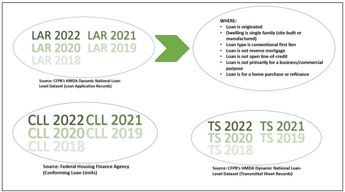
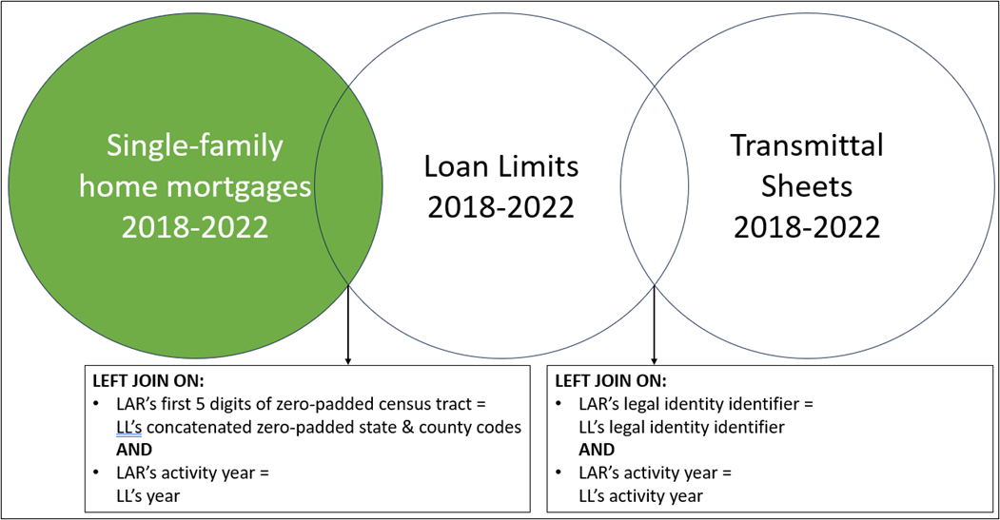

# HMDA
Repository for working with Home Mortgage Disclosure Act data.

## Data sources

This analysis relies on Home Mortgage Disclosure Act data disclosures maintained by the Consumer Financial Protection Bureau. Both the loan application records and transmittal sheet records can be found <a href="https://ffiec.cfpb.gov/data-publication/dynamic-national-loan-level-dataset/2022" target="_blank">here</a>.

LAR data provides dozens of details about every loan application. This analysis narrowed the pool of LAR records to originated, conventional, first-lien, non-reverse-mortgage, non-open-line-of-credit, noncommercial mortgages used to purchase or refinance single-family dwellings.

Transmittal sheet data provides lenders' names, addresses and legal entity identifiers. 

This analysis also relies on the conforming loan limits set each year by the Federal Housing Finance Agency. Annual limits by unit count and county can be found <a href="https://www.fhfa.gov/DataTools/Downloads/Pages/Conforming-Loan-Limit.aspx" target="_blank">here</a>.

## Data acquisition

Data was imported into a SQLite database using Python. The notebook used in this step is available <a href="./createSQL.py" target="_blank">here</a>.

When importing LAR data, 'Exempt' was used as a null value when reading numeric columns in the source data, state_code and applicant_age/co_applicant_age (which are given as age ranges) were imported as strings, and pipes were used as delimiters.

When importing TS data, pipes were used as delimiters and a column was added concatenating respondent_name and respondent_state to serve as a unique identifier for entities that had common names.

Loan limit dataframes were concatenated in their entirety, with a column added for year and columns renamed for easier querying.

## Data joining

Starting with the filtered LAR data, conforming loan limit data and transmittal sheet data were each left-joined. Left joins were chosen to prevent the loss of any loans in the filtered LAR data in the event that loans are missing the attributes used to join with the other datasets.

Loan limits were joined based on the first five digits of zero-padded LAR census tracts being equal to loan limits' concatenated zero-padded state and county codes <strong>AND</strong> LAR's activity year being equal to loan limits' year. LAR census tracts were chosen instead of LAR county and state codes because census tracts had far fewer missing or errant data.

Transmittal sheet data was joined based on legal identiy identifier and activity year.

## Data queries

Queries were run to assess changes in the volume and amount of jumbo loans from 2018-2022, the most active jumbo markets geographically in 2022, the most active jumbo lenders in 2022 and the jumbo lending profiles of First Republic Bank and Silicon Valley Bank.

In each of these queries, whether a loan was labeled "jumbo" was determined based on the mortgaged property's county and number of units and on the year the loan was made. If the loan exceeded its respective limit, it was labeled "jumbo." In a minority of cases, loans were missing census tract data, which are used to find their loan limits. In those instances, the mode by unit-count for the loan's year was substituted.

#### Jumbo loans over time

<a href="./queries/totalsByYear.sql" target="_blank">This query</a> retrieves the total amount of money loaned, the number of loans made and the number of loan providers each year for jumbo and conforming loans. The query sums loan_amount, counts lei and counts the distinct lei, grouped by year and jumbo/conforming.

#### Jumbo loans by location 2022

<a href="./queries/totalsByCensusTract.sql" target="_blank">This query</a> retrieves the state abbreviation, total amount of money loaned, number of loans made and number of loan providers in 2022 for jumbo and conforming loans, grouped by census tract and jumbo/conforming.

#### Jumbo loans by lender 2022

<a href="./queries/totalsByLEI.sql" target="_blank">This query (leiAgain.sql)</a> retrieves the respondent name, total amount of money loaned and number of loans made in 2022 for jumbo and conforming loans, grouped by legal entity identifier and jumbo/conforming.

#### Jumbo loans by First Republic and Silicon Valley banks

<a href="./queries/fr_sv_banks.sql" target="_blank">This query</a> retrieves the respondent name, uyear, loan amount, income, property value, combined loan-to-value ratio, interest rate, rate spread, county-state code, census tract, state and jumbo status for jumbo and conforming loans originated by First Repbulic Bank and Silicon Valley Bank from 2018 to 2022.